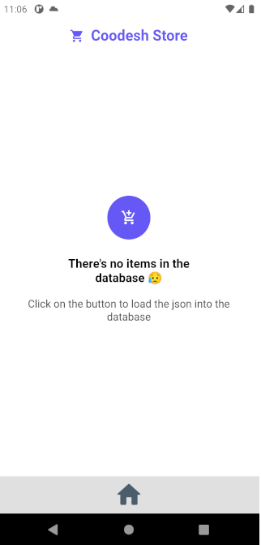
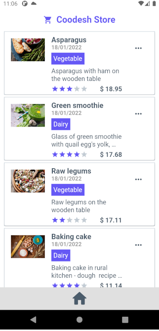
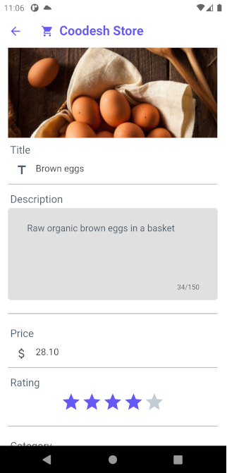
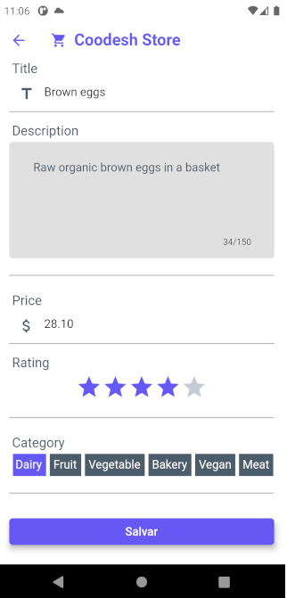
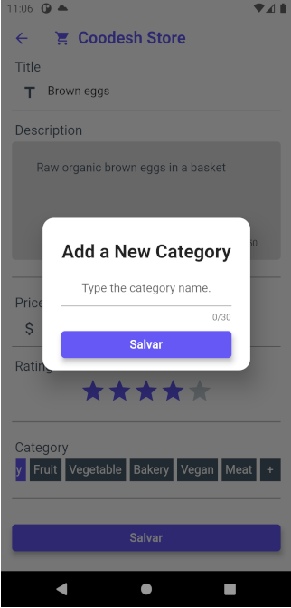
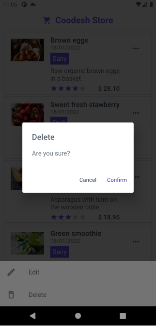

# 🛒 Coodesh Store 
### Um Aplicativo feito para um Flutter Challenge da Coodesh.

## API / Firebase
 
###  Base de Dados
 
- Foi utilizado o Firebase Realtime DB para a construção deste aplicativo.

- Antes de rodar o app, configure seu Firebase através do arquivo google-services.json, como é ensinado [aqui](https://firebase.google.com/docs/android/setup).

###  Configurando as variáveis de compilação

- As imagens utilizadas no app são armazenadas no Cloudinary, para que o app possa fazer o download e cache das imagens. Por isso, para que o aplicativo funcione corretamente será preciso configurar na sua IDE os seguintes valores:

        - CLOUD_IMAGE_API_KEY={valor}
        - CLOUD_IMAGE_API_SECRET={valor}
        - CLOUD_NAME={valor}

- Também é possível rodar o aplicativo passando as variáveis diretamente no terminal:

        flutter run --dart-define=CLOUD_IMAGE_API_KEY=121855934736727 --dart-define=CLOUD_IMAGE_API_SECRET=K3xbk21ZkZ04Mnz79orUoXxmEi0 --dart-define=CLOUD_NAME=dtlmxp4oo

- Mesmo que você não configure o Cloudinary, o aplicativo ainda conseguirá carregar o banco a partir do JSON, remover produtos e editá-los, **desde que a imagem não seja trocada**.

###  Carregando a Base de Dados com o [products.json](products.json)
 
- Ao configurar o Firebase e executar o aplicativo, o aplicativo mostrará esta tela:

- Ao clicar no ícone centralizado, o JSON será enviado para o Firebase configurado.

## Aplicação Flutter

#### Listar produtos

 
#### Editar produto
 

 
#### Remover produto

## Fazer Download do APK

- O aplicativo está disponível para download [aqui](https://drive.google.com/file/d/1ylQlKy2Knqcmofr_DxjoBiEeidWr1i7q/view?usp=sharing)

